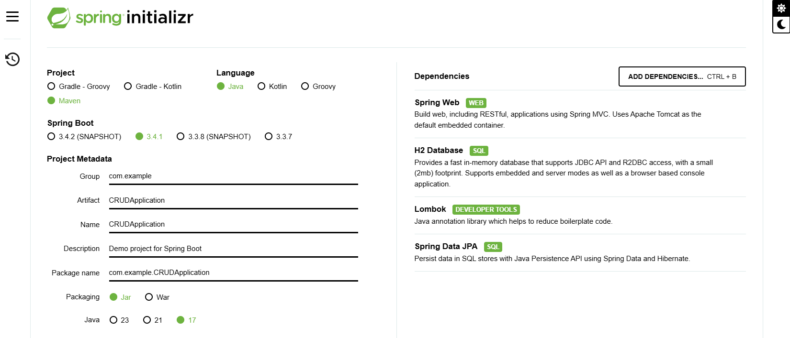

SPRING-BOOT CRUD: prashant sharma youtube channel (using mock H2 database)
## Step 1: Setup initializr



Dependencies:
- **Spring Web**: Enables building web applications, including RESTful services, with Spring MVC and uses Apache Tomcat as the default embedded container.
- **H2 Database**: Provides a lightweight, fast in-memory database with JDBC and R2DBC support, offering both embedded and server modes, plus a browser-based console.
- **Lombok**: A Java annotation library that reduces boilerplate code like getters, setters, and constructors.
- **Spring Data JPA**: Simplifies database interactions using Java Persistence API (JPA) and integrates with Hibernate for data persistence in SQL stores.

## Step 2: application.properties Configuration:
### Spring Boot Application Properties

```
/*
 * *******************************************************************************************************
 * ** Server Configuration **
 *  - Sets the port on which the embedded web server will run (9090).
 *  server.port=9090
 *
 * ** Database Configuration **
 *  - Configures the JDBC URL for the H2 in-memory database, which is used during the application runtime.
 *  spring.datasource.url=jdbc:h2:mem:testdb
 *
 *  - Specifies the driver class for the H2 database.
 *  spring.datasource.driverClassName=org.h2.Driver
 *
 *  - Sets the username for the database connection (default is 'sa' for H2).
 *  spring.datasource.username=sa
 *
 *  - Sets the password for the database connection (left blank here).
 *  spring.datasource.password=
 *
 * ** JPA & Hibernate Configuration **
 *  - Enables the display of SQL statements in the log for debugging purposes.
 *  spring.jpa.show-sql=true
 *
 *  - Specifies the Hibernate dialect for the H2 database to communicate with Hibernate.
 *  spring.jpa.properties.hibernate.dialect=org.hibernate.dialect.H2Dialect
 *
 *  - Configures Hibernate's behavior for schema management ('update' will automatically modify the schema).
 *  spring.jpa.hibernate.ddl-auto=update
 *
 * ** H2 Console Configuration **
 *  - Enables the H2 database console, providing a web-based interface for interacting with the database.
 *  spring.h2.console.enabled=true
 *
 *  - Specifies the path for accessing the H2 console (set to '/h2-ui' in this case).
 *  spring.h2.console.path=/h2-ui
 * *******************************************************************************************************
 */

server.port=9090

spring.datasource.url=jdbc:h2:mem:testdb
spring.datasource.driverClassName=org.h2.Driver
spring.datasource.username=sa
spring.datasource.password=

spring.jpa.show-sql=true
spring.jpa.properties.hibernate.dialect=org.hibernate.dialect.H2Dialect
spring.jpa.hibernate.ddl-auto=update

spring.h2.console.enabled=true
spring.h2.console.path=/h2-ui
```
## Step 3: Flowdiagram of this project:
### Spring Boot MVC Structure

The structure follows the standard Spring Boot MVC pattern, where:
- **Model** (Book.java) interacts with **Repository** (BookRepository). `Model(Book)` represents the data. `Model` interacts with `Repository` for database operations.
- **Repository** (BookRepository.java) takes **Book** objects as parameters and is **autowired** in the **Controller**. `Repository(BookRepository.java)` provides data to **Controller (BookController.java)**. `Repository` interacts with `Model(Book.java)` to perform CRUD operations.
- **Controller** (BookController.java) is **autowired** with **Repository** to manage HTTP requests and responses, and interacts with the **Repository** to perform CRUD operations.


```
+-------------+           +---------------+           +------------------+           +-------------+
|   Client    |  ----->   | BookController |  ----->   |  BookRepository  |  ----->   |  Database   |
| (HTTP Client)           |  (REST API)    |           |  (JPA Repository)|           | (Books DB)  |
+-------------+           +---------------+           +------------------+           +-------------+
        |                        |                          |                          |
        |----> HTTP Request ----->|                          |                          |
        |                        |-----> Perform CRUD ----->|                          |
        |                        |                          |                          |
        |                        |                          |                          |
        |                        |                          |-----> Book Entity        |
        |                        |                          | (Book Object, Data)     |
        |                        |                          |     (id, title, author) |
        |                        |                          |                          |
        |                        |<----- Return Data -------|                          |
        |                        |                          |                          |
        |<---- HTTP Response ----|                          |                          |
        |                        |                          |                          |
        |                        |                          |                          |
        +------------------------+--------------------------+--------------------------+

```

Step 4: Files:

**Book.java**
```java
package com.example.CRUDApplication.model;

import jakarta.persistence.*;
import lombok.*;
// * * * * * * * * * * * * * * * * * * * * * * * * * * * * * * * * * * * * * * * * * * * * * * * * * *
// File: Book.java (Model Class)
// 1. This class represents the "Book" entity which will be mapped to the "Books" table in the database.
// 2. We define the fields (id, title, and author) that match the columns in the database table.
// 3. We use annotations like @Entity and @Table to specify that this is a JPA entity and the table name is "Books".
// 4. Lombok annotations like @Getter, @Setter, @NoArgsConstructor, and @AllArgsConstructor are used to automatically generate getters, setters, constructors, and the toString() method.
// 5. The @Id annotation specifies that "id" is the primary key of the entity.
// 6. @GeneratedValue specifies the auto-generation strategy for the id.
// 7. The @Column annotation is used to map each field to a column in the table. It is optional if field names match column names.
// 8. This class will be used by the repository layer for performing CRUD operations.

@Entity
@Table(name="Books")
@NoArgsConstructor
@AllArgsConstructor
@Setter
@Getter
@ToString

public class Book {
    @Id
    @GeneratedValue(strategy = GenerationType.AUTO)
    private Long id;

    @Column
    private String title;

    @Column
    private String author;
}
```

**BookRepository.java**
```java
package com.example.CRUDApplication.repo;

import com.example.CRUDApplication.model.Book;
import org.springframework.data.jpa.repository.JpaRepository;
import org.springframework.stereotype.Repository;

// * * * * * * * * * * * * * * * * * * * * * * * * * * * * * * * * * * * * * * * * * * * * * * * * * *
// File: BookRepository.java (Repository Interface)
// 1. This interface extends JpaRepository, which provides built-in methods for CRUD operations (save, findById, delete, etc.) on the Book entity.
// 2. JpaRepository<Book, Long>: The first parameter, Book, is the type of the entity/ Object the repository will manage. Book is object where we will do crud. The second parameter, Long, is the type of the entity's primary key/ unique identifier (id).
// 3. @Repository annotation marks this interface as a Spring Data repository, enabling auto-implementation of common CRUD methods.
// 4. This interface does not need to implement the CRUD methods manually. JpaRepository automatically provides them, including findAll(), findById(), save(), deleteById(), etc.
@Repository
public interface BookRepository extends JpaRepository<Book, Long> {
}
```

**BookController.java**
```java
package com.example.CRUDApplication.controller;

import com.example.CRUDApplication.model.Book;
import com.example.CRUDApplication.repo.BookRepository;
import org.springframework.beans.factory.annotation.Autowired;
import org.springframework.http.HttpStatus;
import org.springframework.http.ResponseEntity;
import org.springframework.web.bind.annotation.*;
// 3
import java.util.ArrayList;
import java.util.List;
import java.util.Optional;
// * * * * * * * * * * * * * * * * * * * * * * * * * * * * * * * * * * * * * * * * * * * * * * * * * *
// File: BookController.java (Controller Class)
// 1. The class is annotated with @RestController to indicate that it's a Spring MVC controller that returns JSON or XML responses to HTTP requests.
// 2. @RequestMapping("/api") defines the base path for all the methods in this controller.
// 3. We need BookRepository object here to perform crud here. So, We autowire the BookRepository to perform CRUD operations on the Book entity/Object.
// 4. The controller has endpoints for:
//    - GET all books (/getAllBooks) - Returns a list of all books from the database.
//    - GET a specific book by ID (/getBookById/{id}) - Returns a single book with the specified ID.
//    - POST to add a new book (/addBook) - Saves a new book to the database.
//    - POST to update a book by ID (/updateBook/{id}) - Updates the book's information with the provided details.
//    - DELETE to remove a book by ID (/deleteBookById/{id}) - Deletes a book with the specified ID.
//    - DELETE to remove all books (/deleteAllBooks) - Deletes all books in the database.
// 5. In Restful api, we return response as ResponseEntity. ResponseEntity is used to wrap the HTTP response, allowing us to return status codes along with the data or error messages.
// 6. Path variables (@PathVariable) are used to pass dynamic parameters in the URL, like the book ID in update and delete operations.
// 7. The methods return appropriate HTTP status codes like HttpStatus.OK (200), HttpStatus.NOT_FOUND (404), and HttpStatus.INTERNAL_SERVER_ERROR (500) based on the result of each operation.
@RestController
@RequestMapping("/api")
public class BookController {
    @Autowired
    BookRepository bookRepository;

    @GetMapping("/getAllBooks")
    public ResponseEntity<List<Book>> getAllBooks() {
        try {
            List<Book> bookList = new ArrayList<>();
            bookRepository.findAll().forEach(bookList::add);

            if (bookList.isEmpty()) {
                return new ResponseEntity<>(HttpStatus.NO_CONTENT);
            }

            return new ResponseEntity<>(bookList, HttpStatus.OK);
        } catch(Exception ex) {
            return new ResponseEntity<>(HttpStatus.INTERNAL_SERVER_ERROR);
        }
    }

    @GetMapping("/getBookById/{id}")
    public ResponseEntity<Book> getBookById(@PathVariable Long id) {
        Optional<Book> bookObj = bookRepository.findById(id);
        if (bookObj.isPresent()) {
            return new ResponseEntity<>(bookObj.get(), HttpStatus.OK);
        } else {
            return new ResponseEntity<>(HttpStatus.NOT_FOUND);
        }
    }

    @PostMapping("/addBook")
    public ResponseEntity<Book> addBook(@RequestBody Book book) {
        try {
            Book bookObj = bookRepository.save(book);
            return new ResponseEntity<>(bookObj, HttpStatus.CREATED);
        } catch (Exception e) {
            return new ResponseEntity<>(HttpStatus.INTERNAL_SERVER_ERROR);
        }
    }

    @PostMapping("/updateBook/{id}")
    public ResponseEntity<Book> updateBook(@PathVariable Long id, @RequestBody Book book) {
        try {
            Optional<Book> bookData = bookRepository.findById(id);
            if (bookData.isPresent()) {
                Book updatedBookData = bookData.get();
                updatedBookData.setTitle(book.getTitle());
                updatedBookData.setAuthor(book.getAuthor());

                Book bookObj = bookRepository.save(updatedBookData);
                return new ResponseEntity<>(bookObj, HttpStatus.CREATED);
            }

            return new ResponseEntity<>(HttpStatus.NOT_FOUND);
        } catch (Exception e) {
            return new ResponseEntity<>(HttpStatus.INTERNAL_SERVER_ERROR);
        }
    }

    @DeleteMapping("/deleteBookById/{id}")
    public ResponseEntity<HttpStatus> deleteBook(@PathVariable Long id) {
        try {
            bookRepository.deleteById(id);
            return new ResponseEntity<>(HttpStatus.OK);
        } catch (Exception e) {
            return new ResponseEntity<>(HttpStatus.INTERNAL_SERVER_ERROR);
        }
    }

    @DeleteMapping("/deleteAllBooks")
    public ResponseEntity<HttpStatus> deleteAllBooks() {
        try {
            bookRepository.deleteAll();
            return new ResponseEntity<>(HttpStatus.NO_CONTENT);
        } catch (Exception e) {
            return new ResponseEntity<>(HttpStatus.INTERNAL_SERVER_ERROR);
        }
    }
}
```