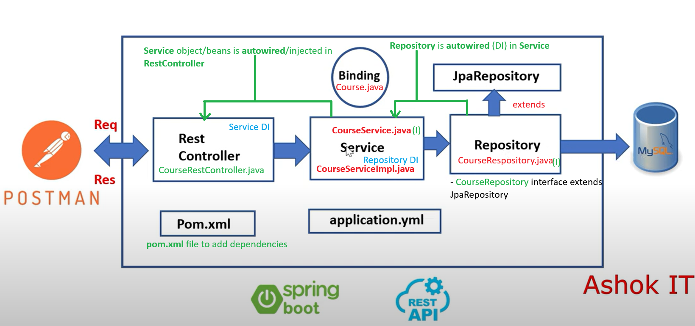

## Project Structure:
Source: Ashok IT

youtube: https://www.youtube.com/watch?v=fbpeK-4y7Mo&t=128s&ab_channel=AshokIT

github code: https://github.com/ashokitschool/springboot_rest_api_crud_mysql/tree/main



This project consits of Springboot with mySql
Folders: 

- **binding** (`Course.java`), 
- **repo** (`CourseRepostiory.java<I>`), It extends JpaRepository
- **rest** (`CourseRestController.java`), 
- **service** (`CourseService.java`, `CourseServiceImpl.java<I>`)


### STEP 1: INSTALL DEPENDENCIES


1. **Lombok** - Reduces boilerplate code, generates `getters`, `setters`, `constructors(no args, args)`, `toString()`, `equals()`, and `hashCode()` automatically.  
2. **Spring Data JPA** - Simplifies database interaction using JPA, provides automatic repository implementations, and supports pagination and custom queries.  
3. **MySQL Driver** - Enables connection to MySQL database for data storage and retrieval.  
4. **Spring Web** - Provides components for building web applications and RESTful APIs, handling HTTP requests and responses.

### STEP 2:  
Convert `application.properties` to `application.yaml`.
```yaml
server:
  port: 9090  # Set server port to 9090

spring:
  datasource:
    username: root  # Ensure this username is correct for MySQL
    password: root  # Ensure this password is correct for MySQL
    url: jdbc:mysql://localhost:3306/sbms?useSSL=false&serverTimezone=UTC  # JDBC URL with timezone setting (localhost, port 3306, database name: sbms)
    driver-class-name: com.mysql.cj.jdbc.Driver  # MySQL JDBC driver class (use the correct version)

  jpa:
    hibernate:
      ddl-auto: update  # Automatically update the schema on startup (create, update, or validate the schema based on the entity classes)
      dialect: org.hibernate.dialect.MySQL8Dialect  # Explicitly set the Hibernate dialect for MySQL
    show-sql: true  # Display SQL queries in the console/logs for debugging purposes
    open-in-view: false
    properties:
      hibernate:
        format_sql: true  # Format the SQL queries for better readability
        generate_statistics: true  # Enable Hibernate statistics for performance tracking

-- Comments--
# Logging settings
#  logging:
#    level:
#      org.springframework.web: DEBUG  # Enable debug level logging for Spring Web
#      com.fasterxml.jackson.databind: DEBUG  # Enable debug level logging for Jackson data binding
```

### STEP 3: Components and Their Roles

### **CourseRestController**
- Exposes **REST API** endpoints for course operations.
- Interacts with **CourseService** (interface) to perform actions related to course management.

### **CourseService**
- Defines the operations (abstract methods) that need to be implemented in **CourseServiceImpl**.
- Acts as a **contract** for the service layer, ensuring that business logic is separated from controller logic.

### **CourseServiceImpl**
- Implements the **CourseService** interface.
- Handles the **business logic** for CRUD operations on **Course** entities.
- Interacts with the **repository** to persist or retrieve data.

### **CourseRepository**
- Provides data access methods (via **JpaRepository**) for saving, retrieving, and deleting **Course** entities from the database.

### **Course**
- A **model** class used for transferring course data between the client and server (via **REST**).
- Represents a **Course** entity for persistence in the database.

#### Files:

**Course.java**
```java
/*
 * This class is used as a data binding object, serving as a model to persist and retrieve 
 * course-related data from the database. It acts as a bridge between the data layer (e.g., 
 * a relational database) and the application layer by mapping to a database table, and 
 * provides an easy-to-use representation of the course data.
 * 
 * The class uses JPA annotations for mapping the entity to a database table and columns. 
 * It also includes JSON property annotations to handle the serialization and deserialization 
 * of the object when interacting with APIs.
 * 
 * @Entity - Specifies that this class is a JPA entity, making it part of the persistence layer. 
 * @Table(name = "COURSE_DTLS") - Maps the class to a specific table in the database ("COURSE_DTLS"). If table name is not provided here, by default table name will be Class name like: 'Course' here.
 * @Id - Marks the `cid` field as the primary key.
 * @GeneratedValue(strategy = GenerationType.IDENTITY) - Automatically generates the value for the primary key.
 * @JsonProperty - Ensures that the `name` and `price` fields are serialized and deserialized with specific JSON property names.
 * 
 * The fields `cid`, `name`, and `price` represent the course ID, name, and price respectively, 
 * and are mapped to the corresponding columns in the database table.
 */
package com.example.CRUDCourse.binding;

import com.fasterxml.jackson.annotation.JsonProperty;
import jakarta.persistence.*;
import lombok.Data;
import lombok.ToString;

@Data // Lombok generates getters, setters, and toString() method
@Entity // Represents a persistence-related component (JPA entity)
@Table(name = "COURSE_DTLS") // Maps the class to a table named "COURSE_DTLS"

public class Course {

    @Id
    @GeneratedValue(strategy = GenerationType.IDENTITY)
    private Integer cid;

    @JsonProperty("name")
    private String name;
    
    @JsonProperty("price")
    private Double price;

    @Override
    public String toString() {
        return "Course [cid=" + cid + ", name=" + name + ", price=" + price + "]";
    }
}
```
**CourseRepository.java**
```java
/*
 * Repository is used to perform operation with database. It will extend properties of JPA.
 * I will be injected in `CourseServiceImpl.java` to do crud on database.
 * This is the repository interface for the `Course` entity. Repositories in Spring Data JPA 
 * are used to perform CRUD (Create, Read, Update, Delete) operations on the database without 
 * needing to write any custom query logic. By extending JpaRepository, this interface inherits 
 * several predefined methods that allow for seamless interaction with the database.
 * 
 * The CourseRepository interface extends JpaRepository, providing methods such as:
 * - save(S entity): to insert or update a course.
 * - findById(ID id): to retrieve a course by its primary key (cid).
 * - findAll(): to retrieve all courses.
 * - deleteById(ID id): to delete a course by its ID.
 * 
 * The first generic type parameter `Course` represents the entity class, and the second 
 * parameter `Serializable` represents the type of the primary key (cid) of the entity.
 * 
 * Spring Data JPA automatically provides implementations for the methods defined in JpaRepository 
 * at runtime, allowing you to interact with the database without needing to manually implement 
 * the logic for basic CRUD operations.
 * 
 * The `@Repository` annotation is typically used to mark a class as a Spring Data Repository, 
 * but it is optional in this case since Spring Data JPA automatically identifies the repository 
 * interface during runtime.
 */
package com.example.CRUDCourse.repo;

import com.example.CRUDCourse.binding.Course;
import org.springframework.data.jpa.repository.JpaRepository;
import java.io.Serializable;
import org.springframework.stereotype.Repository;

@Repository // Optional: The repository will be scanned at runtime by Spring.
public interface CourseRepository extends JpaRepository<Course, Serializable> {

}
```

**CourseService.java**
```java
/*
 * This is a service interface for handling business logic related to course operations.
 * It defines abstract methods for performing CRUD operations on courses, such as 
 * inserting or updating a course, retrieving a course by its ID, fetching all courses, 
 * and deleting a course by its ID. The implementation of these methods will be provided 
 * in a service class.
 * 
 * The upsert method (insert or update) checks the course's primary key (cid) and 
 * either inserts a new course or updates an existing one.
 * 
 * The getById method retrieves a course based on its unique ID (cid).
 * 
 * The getAllCourses method returns a list of all available courses.
 * 
 * The deleteById method deletes a course by its unique ID (cid).
 * 
 * This interface allows for clean separation of concerns by defining the contract 
 * for course-related operations, which can be implemented by different service classes 
 * depending on the application's requirements.
 */
package com.example.CRUDCourse.service;

import com.example.CRUDCourse.binding.Course;

import java.util.List;

// Create service interface to write our logic
// These are abstract methods available for courseService ...
public interface CourseService {
    // Write methods
    public String upsert(Course course);

    public Course getById(Integer cid);

    public List<Course> getAllCourses();

    public String deleteById(Integer cid);

}
```
**CourseServiceImpl.java**
```java
/*
 * This is the implementation of the CourseService interface. It defines the actual 
 * business logic for handling course-related operations such as upsert, retrieval, 
 * fetching all courses, and deleting a course.
 * 
 * In this implementation, we use dependency injection to inject an instance of 
 * CourseRepository (a Spring Data JPA repository) that allows us to interact with 
 * the database for course persistence.
 * 
 * The methods implemented here are:
 * 
 * 1. upsert(Course course): 
 *    This method saves a course to the database. If the course has an existing 
 *    primary key (cid), it will update the existing record; otherwise, it will insert a new one.
 * 
 * 2. getById(Integer cid):
 *    This method retrieves a course by its unique ID. If the course exists, it returns the course; 
 *    otherwise, it returns null.
 * 
 * 3. getAllCourses():
 *    This method retrieves a list of all courses from the database.
 * 
 * 4. deleteById(Integer cid):
 *    This method deletes a course by its ID. If the course with the given ID exists, it will be deleted;
 *    if no course is found with the given ID, it returns a "No Record Found" message.
 * 
 * The CourseServiceImpl class is annotated with @Service, indicating that it is a service component 
 * in the Spring application context, and Spring will manage its lifecycle.
 */
package com.example.CRUDCourse.service;

import com.example.CRUDCourse.binding.Course;
import com.example.CRUDCourse.repo.CourseRepository;
import org.springframework.beans.factory.annotation.Autowired;
import org.springframework.stereotype.Service;

import java.util.List;
import java.util.Optional;

// What we inject here: CourseRepository (to interact with the database)
// Implementing the CourseService interface in CourseServiceImpl
// Override all the CourseService methods here
@Service
public class CourseServiceImpl implements CourseService {

    // Do dependency injection
    @Autowired
    private CourseRepository courseRepo;

    @Override
    public String upsert(Course course) {
        // upsert operation: insert or update based on primary key (cid)
        courseRepo.save(course); // Saves the course object, performing an upsert if the ID exists

        return "success";
    }

    @Override
    public Course getById(Integer cid) {
        // Retrieves a course by its ID
        Optional<Course> findById = courseRepo.findById(cid);

        // If course is found, return it; otherwise, return null
        if (findById.isPresent()) {
            return findById.get();
        }
        return null;
    }

    @Override
    public List<Course> getAllCourses() {
        // Returns all courses in the database
        return courseRepo.findAll();
    }

    @Override
    public String deleteById(Integer cid) {
        // Deletes a course by its ID
        if (courseRepo.existsById(cid)) {
            courseRepo.deleteById(cid); // Deletes the course if it exists
            return "Delete Success";
        } else {
            return "No Record Found"; // Returns message if no course with the given ID is found
        }
    }

}
```
**CourseRestController.java**
```java
/*
 * This is the REST controller for handling HTTP requests related to the `Course` entity.
 * The `CourseRestController` class provides endpoints for performing CRUD operations 
 * on courses, such as creating, retrieving, updating, and deleting courses.
 * 
 * The class is annotated with `@RestController`, indicating that it is a Spring MVC controller 
 * where each method returns data directly (typically in JSON format). It is responsible for 
 * handling incoming HTTP requests and calling the corresponding service layer methods to 
 * perform the required actions.
 * 
 * The methods provided are as follows:
 * 
 * 1. `createCourse`: This method handles POST requests to the `/course` endpoint and allows 
 *    the creation of a new course. It uses `@RequestBody` to bind the incoming JSON payload 
 *    to a `Course` object, then calls the `upsert` method from the `CourseService` to insert 
 *    the course into the database.
 * 
 * 2. `getCourse`: This method handles GET requests to the `/course/{cid}` endpoint. It retrieves 
 *    a course by its unique ID (`cid`) and returns the course data wrapped in a `ResponseEntity`.
 * 
 * 3. `getAllCourses`: This method handles GET requests to the `/courses` endpoint and returns a 
 *    list of all courses from the database by calling the `getAllCourses` method of `CourseService`.
 * 
 * 4. `updateCourse`: This method handles PUT requests to the `/course` endpoint, allowing the 
 *    update of an existing course. It uses the same `upsert` method as in the `createCourse` method 
 *    but is typically used for updating an existing course.
 * 
 * 5. `deleteCourse`: This method handles DELETE requests to the `/course/{cid}` endpoint. It 
 *    deletes a course by its ID (`cid`) using the `deleteById` method from the `CourseService`.
 * 
 * Each method returns a `ResponseEntity` that includes the appropriate HTTP status code and 
 * the result of the operation (either a success message or the course data).
 * 
 * The `@Autowired` annotation is used to inject the `CourseService` dependency into the controller,
 * which provides the actual logic for the CRUD operations.
 */
package com.example.CRUDCourse.rest;

import com.example.CRUDCourse.binding.Course;
import com.example.CRCRUDCourse.service.CourseService;
import org.springframework.beans.factory.annotation.Autowired;
import org.springframework.http.HttpStatus;
import org.springframework.http.ResponseEntity;
import org.springframework.web.bind.annotation.*;
import java.util.List;

@RestController
public class CourseRestController {

    @Autowired
    private CourseService courseService;

    // Endpoint to create a new course
    @PostMapping("/course")
    public ResponseEntity<String> createCourse(@RequestBody Course course) {
        System.out.println("Controller method hit");
        System.out.println("Course Obj: " + course.toString());  // Ensure this is not null
        String status = courseService.upsert(course); // Calls upsert method in service
        return new ResponseEntity<>(status, HttpStatus.CREATED); // Returns HTTP status 201 (Created)
    }

    // Endpoint to retrieve a course by its ID
    @GetMapping("/course/{cid}")
    public ResponseEntity<Course> getCourse(@PathVariable Integer cid) {
        Course course = courseService.getById(cid); // Calls getById method in service
        return new ResponseEntity<>(course, HttpStatus.OK); // Returns HTTP status 200 (OK)
    }

    // Endpoint to retrieve all courses
    @GetMapping("/courses")
    public ResponseEntity<List<Course>> getAllCourses() {
        List<Course> allCourses = courseService.getAllCourses(); // Calls getAllCourses method in service
        return new ResponseEntity<>(allCourses, HttpStatus.OK); // Returns HTTP status 200 (OK)
    }

    // Endpoint to update an existing course
    @PutMapping("/course")
    public ResponseEntity<String> updateCourse(@RequestBody Course course) {
        String status = courseService.upsert(course); // Calls upsert method in service
        return new ResponseEntity<>(status, HttpStatus.OK); // Returns HTTP status 200 (OK)
    }

    // Endpoint to delete a course by its ID
    @DeleteMapping("/course/{cid}")
    public ResponseEntity<String> deleteCourse(@PathVariable Integer cid) {
        String status = courseService.deleteById(cid); // Calls deleteById method in service
        return new ResponseEntity<>(status, HttpStatus.OK); // Returns HTTP status 200 (OK)
    }

}
```
---
## Flow Description:

### CourseRestController (Controller Layer)

- **Purpose**: Handles HTTP requests for CRUD operations related to Course.
- **Injected**: `CourseService` (via `@Autowired`).
- **Connections**:
  - `/course` (POST) → Calls `upsert()` method in `CourseServiceImpl`.
  - `/course/{cid}` (GET) → Calls `getById()` method in `CourseServiceImpl`.
  - `/courses` (GET) → Calls `getAllCourses()` method in `CourseServiceImpl`.
  - `/course` (PUT) → Calls `upsert()` method in `CourseServiceImpl`.
  - `/course/{cid}` (DELETE) → Calls `deleteById()` method in `CourseServiceImpl`.

---

### CourseService (Service Layer Interface)

- **Purpose**: Declares methods for CRUD operations on Course. This is the interface that is implemented by `CourseServiceImpl`.
- **Injected**: None.
- **Connections**:
  - Defines abstract methods for operations like:
    - `upsert()`
    - `getById()`
    - `getAllCourses()`
    - `deleteById()`

---

### CourseServiceImpl (Service Layer Implementation)

- **Purpose**: Implements the `CourseService` interface, providing the actual logic for course-related CRUD operations.
- **Injected**: `CourseRepository` (via `@Autowired`).
- **Connections**:
  - Implements `CourseService` methods such as:
    - `upsert()`
    - `getById()`
    - `getAllCourses()`
    - `deleteById()`
  - Interacts with `CourseRepository` to perform database operations like saving, retrieving, and deleting courses.

---

### CourseRepository (Repository Layer)

- **Purpose**: Extends `JpaRepository` and handles direct interaction with the database for CRUD operations on Course entities.
- **Injected**: None.
- **Connections**:
  - Provides methods like:
    - `save()`
    - `findById()`
    - `findAll()`
    - `deleteById()`
  - Data is stored and fetched from the `COURSE_DTLS` table in the database.

---

### Course (Binding Model)

- **Purpose**: Represents the structure of a Course entity, used to transfer data between the client (via REST) and the database.
- **Injected**: None.
- **Connections**:
  - The `Course` object is used in:
    - `CourseRestController` (as request body or response).
    - `CourseServiceImpl` (for data manipulation).

---
## Concepts: Bean and IoC Container in Spring Boot

### Bean
- In Spring Boot, a **Bean** is any object that is managed by the Spring IoC (Inversion of Control) container. Spring Boot makes it easy to define and manage beans using annotations like `@Component`, `@Service`, `@Repository`, and `@Controller`.
  - **CourseRestController**, **CourseServiceImpl**, and **CourseRepository** are all Spring Boot beans. These beans are automatically instantiated and managed by the Spring IoC container when the application starts.
  - Spring Boot also uses component scanning to automatically detect these beans within the application and register them in the application context.

### IoC (Inversion of Control) Container
- The **IoC Container** in Spring Boot is responsible for managing the lifecycle of beans, including their creation and dependency injection. Spring Boot's IoC container is part of the core Spring framework, enabling Dependency Injection (DI).
  - **Dependency Injection (DI)**: The Spring Boot IoC container injects the required dependencies into beans at runtime. For example, `CourseRestController` has `CourseService` injected by the container, and `CourseServiceImpl` has `CourseRepository` injected.
  - Spring Boot's IoC container simplifies DI using annotations like `@Autowired`, making it easy to wire beans without needing explicit configuration.

### How It Works in This Flow

1. **Application Startup**: 
   - When a Spring Boot application starts, the Spring Boot IoC container is initialized. The container performs **component scanning**, where it searches for classes annotated with `@Component`, `@Service`, `@Repository`, `@Controller`, etc., to identify Spring-managed beans.
   - In this case, the classes `CourseRestController`, `CourseServiceImpl`, and `CourseRepository` are identified as beans and registered in the IoC container.

2. **Dependency Injection**:
   - The IoC container resolves and injects the necessary dependencies into each bean. For example:
     - `CourseRestController` has a `CourseService` dependency, which is injected by the container.
     - `CourseServiceImpl` has a `CourseRepository` dependency, which is also injected.
   - The dependencies are resolved automatically based on the types, and there is no need for explicit configuration or object creation in the code.

3. **Handling Requests**:
   - When an HTTP request is made to a `CourseRestController` endpoint (e.g., `/course`), Spring Boot uses the `CourseRestController` bean to handle the request.
   - The controller calls the appropriate method in the `CourseService` (via `CourseServiceImpl`), which in turn interacts with the `CourseRepository` to fetch or save data in the database.
   - The IoC container manages the lifecycle of these beans, making them available for use whenever needed without manually instantiating them.

### Benefits of Using IoC Container and Beans in Spring Boot
- **Loose Coupling**: The application components (controller, service, and repository) are loosely coupled, as the dependencies are injected by the IoC container. This improves modularity and maintainability.
- **Simplified Configuration**: With Spring Boot's IoC container, you don't need to manually configure beans or worry about their lifecycle management. Spring Boot automatically handles this for you.
- **Easier Testing**: Since dependencies are injected, it’s easier to mock dependencies and write unit tests for individual components, improving testability.
- **Automatic Wiring**: With annotations like `@Autowired`, the IoC container automatically wires dependencies, reducing boilerplate code and simplifying development.
